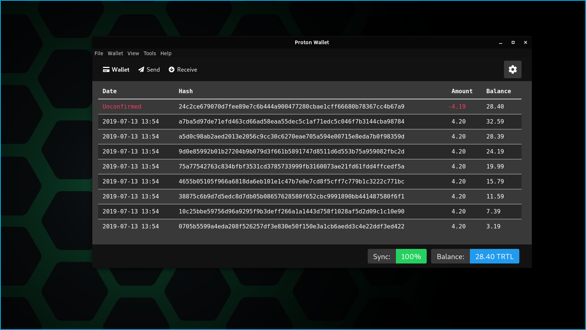
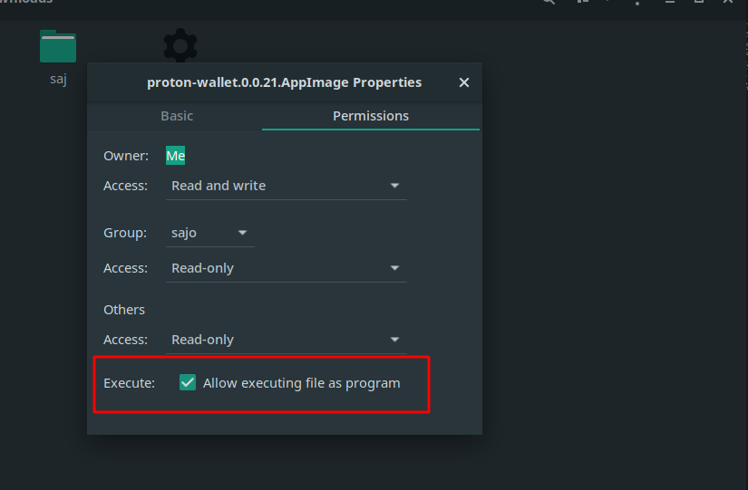
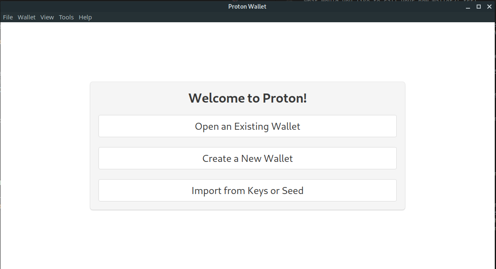
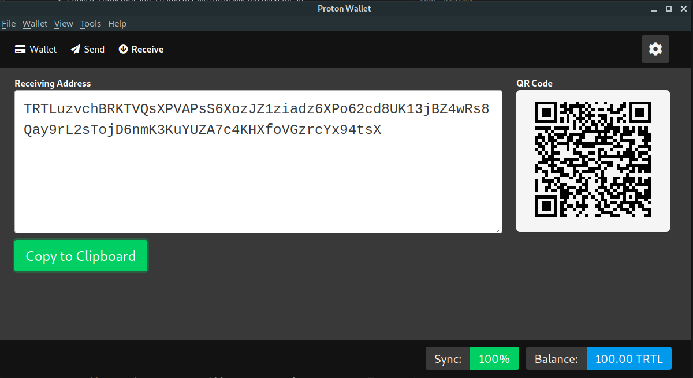
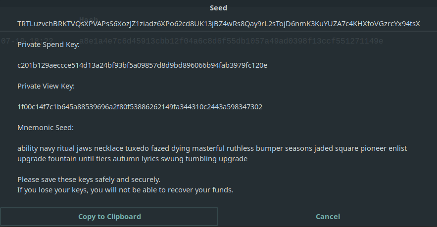
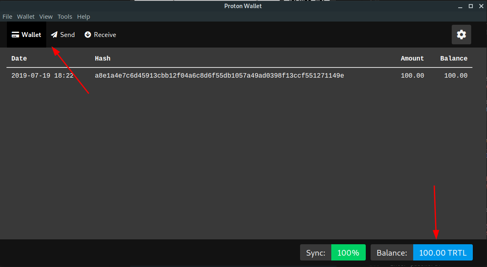
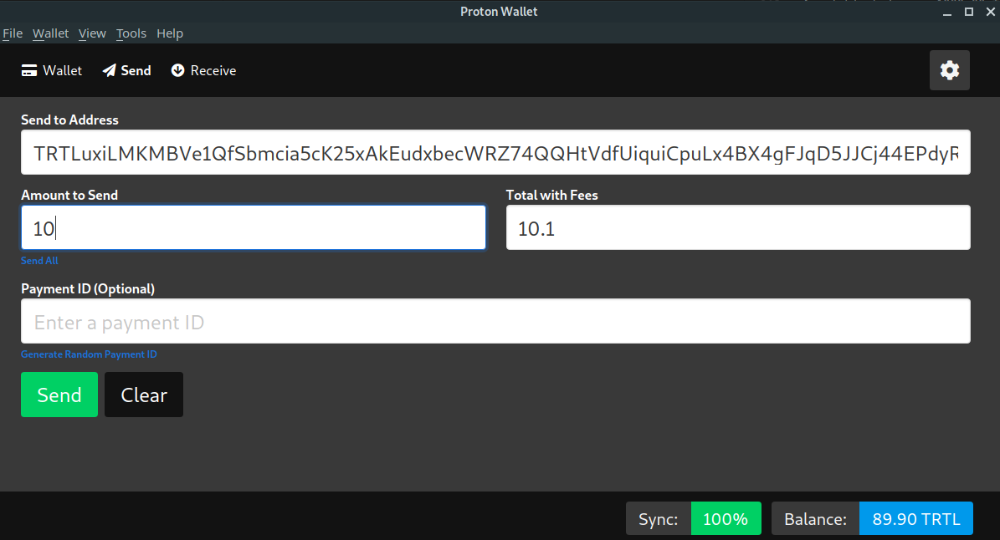
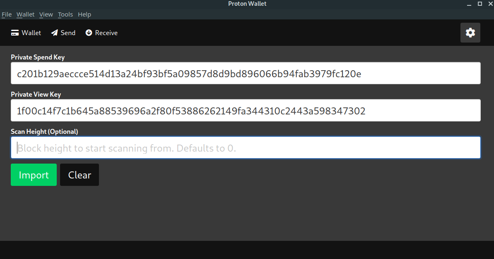

## Screenshot

Here'es a quick image of Proton Wallet:

## Downloading

Binary distributions can be found [here](https://github.com/turtlecoin/turtle-wallet-proton/releases/latest)

Select the appropriate file for the target platform (Windows, Mac, Linux).

Binaries are provided in a `.exe` file for Windows, a `.dmg` file for Mac, and either a `.AppImage` or `.snap` for Linux.  

## Installing 

### Installing on Windows

Run the setup file you downloaded and follow the steps.

### Installing on Mac

Double click the .dmg file to run the app

### Installing on Linux

**AppImage**

After downloading, either:

- make it an executabe through chmod :`chmod a+x proton-wallet.....AppImage`

- Right click
  - Click on Properties
  - Click on permissions
  - And click `Allow executing file as program`  
  

**Snap file**

*Note*: This is not recommended. If you'd like to install it through snap, simply run `snap install proton-wallet`

- Ensure [Snap is installed](https://docs.snapcraft.io/installing-snapd)
- Open up a terminal (Ctrl + Shift + T)
- `cd` to where you downloaded the file
- Run `snap install proton-wallet.....snap`

## Using ProtonWallet

Open the wallet, either by running the executable or looking for it in your start menu.

### First Boot

Upon opening Proton Wallet for the first time, you will see a splash screen.

This will appear only once, after this, the wallet will auto-open the last wallet opened, and opening other wallets or creating new ones will have to be done through the menu bar.

You have the following options, click on the links to jump to associated guides.

- [Open an Existing Wallet](#Opening-a-Wallet)
- [Create a New Wallet](#Creating-a-Wallet)
- [Import from Keys or Seed](#Recovering-your-Wallet)

### Creating a Wallet

- If a wallet is already open, then click on `File` in the top left and then `New`
  - Or press `Ctrl + N` on your keyboard

---

- Choose a directory and a name to save the wallet (no need for an extension)
- Once your wallet is created, you will be given a notice on how to add a password if desired.

- Your wallet will now open in Proton Wallet

- Use `Ctrl + W` or click `File` in the top-left and then `Close` to safely close the wallet

### Opening a Wallet

- If a wallet is already open, then click on `File` in the top left and then `Open`
  - Or press `Ctrl + O` on your keyboard

---

- Navigate to the directory where your wallet is saved and double click on the file

### Viewing Wallet Address

- Click on Receive in the top left
- Your TurtleCoin wallet address and a QR code will be displayed. Click on the `Copy to Clipboard` button to copy your address directly.

### Exporting Keys

Each TurtleCoin  wallet is essentially, just a pair of keys (*View Key* and *Spend Key*) from which the public address is derived.
It is **very** important to export these keys and back them up somewhere that is safe and secure (meaning somewhere reliable/permanent that no one else can access).

In the event of a lost or corrupted wallet file, computer crash, etc., the *View Key*, *Spend Key*, or *Mnemonic Seed* are the only way to restore a wallet and recover the funds it holds.

**DO NOT SHARE IT WITH ANYONE**. **Anyone who has these can *access your funds* and has *complete control* over your wallet.**

Click on `Wallet` in the top left, and then `Backup`. A screen will appear with your address, private spend and view keys, and your mnemonic seed.

Copy the text and store it **safely and securely**.

### Viewing Wallet Balance

You can see your wallet balance at the bottom of the screen in the main `Wallet` screen

### Sending Transactions

To send TurtleCoin:

- Click on the `Send` tab

- Type/paste the address you want to send the TRTL to

- Type the amount of TRTL you want to send (like `100`)
  - The total amount w/ fees will automatically update. If you'd like to increase the fee manually, you may change the value to do so.

- Enter the payment ID if the recipient has provided one. Check the [payment ID section](#payment-id) if you're not sure when/how to use it

- Click on `Send`

- Confirm details and click `OK` or `Cancel` appropriately.

- If the transaction is successful, you will be given a notification:

#### Payment ID

Because transactions on the TurtleCoin blockchain are privatized, in some situations a payment ID is necessary for the recipient to be able to determine where the payment came from, for instance when depositing to an exchange or other service.

**You need it if you're sending TRTL to an exchange**.

To send a transaction with a payment ID, enter it in the send screen.

Note that typically, the service/recipient will generate and provide the required payment ID, and you *do not have to generate your own, despite the option to.*

### Exiting the Wallet

Make sure NOT to click the `X` in the top left or right of the window; that does not save your wallet and may corrupt your wallet. Instead, either: 

- press `Ctrl + W`
- click on `File` in the top left
  - click `Close`

### Recovering your Wallet

- Click on `File` in the top left
- Click `Restore`

Then, depending on what option you take, follow the appropriate guide:

#### Private Spend and View Keys

- Enter your Private Spend Key

- Enter your Private View Key

- Enter the height from which to start scanning for transactions.  
  If you know when you made your wallet, it is highly recommended to input this wallet, as it greatly speeds up syncing. Otherwise, if you're not sure, leave it empty.

- Click `Import`

- Choose a directory and a name to save the wallet

- If the wallet was restored succesfully, you will be given a notice:

#### Mnemonic Seed

- Enter your mnemonic seed

- Enter the height from which to start scanning for transactions.  
  If you know when you made your wallet, it is highly recommended to input this wallet, as it greatly speeds up syncing. Otherwise, if you're not sure, leave it empty.

- Click `Import`

- Choose a directory and a name to save the wallet

- If the wallet was restored succesfully, you will be given a notice:

### Help

If you need any assistance, come ask us in the `#help` channel in the [Discord server](http://chat.turtlecoin.lol)!
