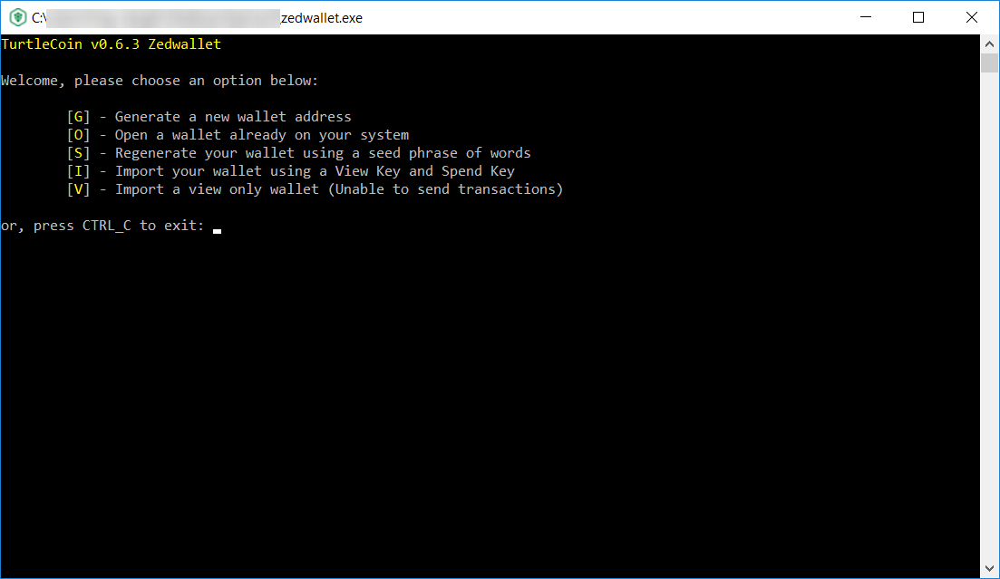
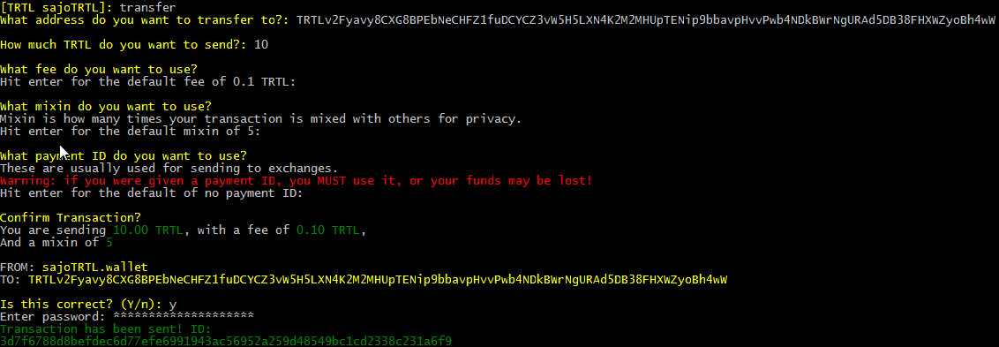
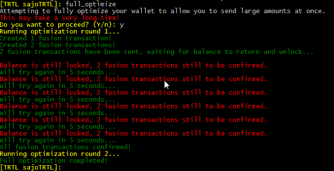

# Using zedwallet

## Screenshots

Here's a quick image of zedwallet in action-




## Downloading

Binary distributions can be found [here](https://github.com/turtlecoin/turtlecoin/releases/latest).

Select the appropriate file for the target platform (Windows, Mac, Linux). 

Windows binaries are provided in `.zip` format, while Mac and Linux are provided in `.tar.gz` format.

## Installing

### Installing on Windows

Extract the *.zip* file (`turtlecoin...-windows.zip`).

### Installing on Mac

Extract the *.tar.gz* file:

```bash
tar -xzf turtlecoin..-mac.tar.gz
```

### Installing on Linux

Extract the *.tar.gz* file: 

```bash
tar -xzf turtlecoin..-linux.tar.gz
```

## Synchronizing the Blockchain

Running `TurtleCoind` will start the *TurtleCoind* network daemon, which will connect to the network and begin downloading and verifying the TurtleCoin blockchain.  

Because the blockchain is constantly growing, the file size is always increasing, and *TurtleCoind* must verify each block (CPU intensive). 

To save time, consider downloading a cached 'bootstrap' of the blockchain (see [Bootstrapping the Blockchain](../Bootstrapping-the-Blockchain) for more info).

#### Using Checkpoints

In **versions 0.4.3+** you can sync a fresh chain from block 0 much quicker by using checkpoints. Follow [this guide](Using-checkpoints) to learn more

### Windows

Double-click to run the `TurtleCoind.exe` executable extracted from the Windows binary zip.

### Mac

Run the `TurtleCoind` binary extracted from the Mac binary tarball:

```bash
./TurtleCoind
```

### Linux

Run the `TurtleCoind` binary extracted from the Linux binary tarball:

```bash
./TurtleCoind
```

#### Using a Remote Node<a name="using-remote-node"></a>

In case you don't want to download the blockchain and verify it everytime, you can instead use a Remote Node to quickly sync the blockchain.

Check [here](Using-remote-nodes) for more info.

## Using zedwallet

With `TurtleCoind` still running in the background or another terminal/shell/command prompt, open zedwallet in a new shell:

#### Windows

Run the `zedwallet.exe` executable from the extracted folder.

#### Mac

```bash
./simplewallet
```

#### Linux

```bash
./simplewallet
```

### Creating a Wallet

In the running *zedwallet* client:  

* Press `G` to generate a new wallet.  
* Enter a filename for the wallet (for example,`trtl`).  
* Enter a strong password to encrypt the wallet with, and confirm it.

```
Welcome, please choose an option below:

        [G] - Generate a new wallet address
        [O] - Open a wallet already on your system
        [S] - Regenerate your wallet using a seed phrase of words
        [I] - Import your wallet using a View Key and Spend Key
        [V] - Import a view only wallet (Unable to send transactions)

or, press CTRL_C to exit: G
What would you like to call your new wallet?: trtl
Give your new wallet a password: *******************
Confirm your new password: *******************

Welcome to your new wallet, here is your payment address:
TRTLv_this_is_your_public_address_ok_to_share_key_Wpk

Please copy your secret keys and mnemonic seed and store them in a secure location:
Private spend key: really_long_random_spend_key_do_not_share_this
Private view key: really_long_random_view_key_do_not_share_this
Mnemonic seed: 25_random_words_do_not_share_this

If you lose these your wallet cannot be recreated!
```

### Opening a Wallet

In the running *zedwallet* client:  

* Press `O` to open an existing wallet file.  
* Enter the filename given for the wallet when it was created.  
* Enter the passphrase given for the wallet when it was created.

```
Welcome, please choose an option below:

        [G] - Generate a new wallet address
        [O] - Open a wallet already on your system
        [S] - Regenerate your wallet using a seed phrase of words
        [I] - Import your wallet using a View Key and Spend Key
        [V] - Import a view only wallet (Unable to send transactions)

or, press CTRL_C to exit: O
What is the name of the wallet you want to open?: trtl
Enter password: **********

Making initial contact with TurtleCoind.
Please wait, this sometimes can take a long time...

Your wallet TRTLv_this_is_your_public_address_ok_to_share_key_Wpk  has been successfully opened!

Scanning through the blockchain to find transactions that belong to you.
Please wait, this will take some time.

Finished scanning blockchain!

Use the help command to see the list of available commands.
Use exit when closing to ensure your wallet file doesn't get corrupted.

[TRTL trtl]:
```

### Viewing Wallet Address

To view a wallet's public address, in the running _zedwallet_ client, after opening a wallet, type `address` and press enter.

```
[TRTL trtl]: address
TRTLv_this_is_your_public_address_ok_to_share_key_Wpk
[TRTL trtl]:
```

### Exporting Keys

Each TurtleCoin  wallet is, essentially, just a pair of keys (*View Key* and *Spend Key*) from which the public address is derived.  
It is **very** important to export these keys and back them up somewhere that is safe and secure (meaning somewhere reliable/permanent that no one else can access). 

In the event of a lost or corrupted wallet file, computer crash, etc., the *View Key* and *Spend Key* are the only way to restore a wallet and recover the funds it holds.

**DO NOT SHARE IT WITH ANYONE**. **Anyone who has these can *access your funds* and has *complete control* over your wallet.**

In the running *zedwallet* client, after opening a wallet, type `export_keys` and press `enter`.  
The *View Key* and *Spend Key* will appear. Copy them and store them **safely and securely**.

```
[TRTL trtl]: export_keys
Enter password: **********
Private spend key: really_long_random_spend_key_do_not_share_this
Private view key: really_long_random_view_key_do_not_share_this
Mnemonic seed: 25_random_words_do_not_share_this
[TRTL trtl]:
```

### Viewing Wallet Balance

In the running _zedwallet_ client, after opening a wallet, type `balance` and press enter to see the wallet's balance.

```
[TRTL trtl]: balance
Available balance: 1000.00 TRTL
Locked (unconfirmed) balance: 100.00 TRTL
Total balance: 1100.00 TRTL
[TRTL trtl]:
```

### Sending TurtleCoin Transactions<a name="tx-trtl"></a>

In the running _zedwallet_ client, after opening a wallet..

- type:`transfer`


- type/paste the address you want to send the TRTL to and press enter

- type the amount of TRTL you want to send (like `100`) and press enter

- press enter to use the default fee of 0.1 TRTL (or set it higher if you're sending a large amount of TRTL)

- press enter to use the default mixin of 5 (or set it higher if you want a more private transaction)

- enter the payment ID if you have one (usually not needed). Check the [payment ID section](#tx-trtl-p-id) if you're not sure when/how to use it.

- confirm that the details are correct and enter `y`. If something is amiss, enter `n` and follow the steps again. 

- enter your password

  Your transaction should be sent!

Example:





Mixin is how many times a transaction is "mixed" with others for obfuscation and privacy. 

Most people suggest a mixin of `5` or more. Larger mixin's will take longer to be confirmed unless a higher fee is used. A mixin of `0` can be used to have a non-private transaction(it is strongly advised not to do so though).

#### Optimizing your Wallet

When you send a transaction you have to include the "key images" of previous payments. So if you're sending 6000 TRTL you might need to include 6 x 1000 TRTL payments from mining to make it up. 

If, however, you had a bigger 6000 payment from somewhere, you could just include that and the transaction would be 6 times smaller.

Fusion transactions take all your small payments and combine them into big ones, so you can send large ones at once

To quickly optimize your wallet, for larger transactions which aren't nearing your full balance and you want to do it quickly, type *(this can take some time)*-

```
quick_optimize
```

and press `y`


If you want to fully optimize your wallet, preparing your wallet to send upto your full balance, type *(this can take some time)*-

````
full_optimize
````

and press `y`


That's it! It will display a message `(Full) optmization completed!` when it's done.




#### Payment ID<a name="tx-trtl-p-id"></a>

Because transactions on the TurtleCoin blockchain are privatized, in some situations a payment ID  is necessary for the recipient to be able to determine where the payment came from, for instance when depositing to an exchange or other service.

**You need it if you're sending TRTL to an exchange, the tipbot or RainBorg**.

To send a transaction with a payment ID, enter it when prompted to.


Note that, typically, the service/recipient will generate and provide the required payment ID. 

### Exiting the Wallet

"Live" wallets loaded into the *zedwallet* client must be synced with the blockchain in order to properly calculate balance, view transaction history, etc. 

It is important to properly save the wallet data before exiting *zedwallet* so that the synchronized data is not lost.

To save a wallet's data and exit, in the running *zedwallet* client, with an open wallet, type `exit` and press `enter`

```
[TRTL trtl]: exit
Saving and exiting wallet, please wait...
Done
(the wallet closes)
```

### Recovering your Wallet

#### Private Spend and View Keys<a name="recover-spend-view-keys"></a>

In the running _zedwallet_ client, 

* type `I` 


* Enter your private spend and view key

* Set a name for your new wallet (for example, `trtl`)

* Specify a strong password to encrypt your wallet with and confirm it

  ```
  Welcome, please choose an option below:

          [G] - Generate a new wallet address
          [O] - Open a wallet already on your system
          [S] - Regenerate your wallet using a seed phrase of words
          [I] - Import your wallet using a View Key and Spend Key
          [V] - Import a view only wallet (Unable to send transactions)

  or, press CTRL_C to exit: I
  Private Spend Key: 0ef591a21666ea8b4b613306d948eaa4a8a5a2d9a83289487277267b0574e
  404
  Private View Key: 692732003133cd11c1c09f9d0e25f19852241a757a33f4c16b5546abb628b9
  0d
  What would you like to call your new wallet?: trtl
  Give your new wallet a password: **********
  Confirm your new password: **********

  Making initial contact with TurtleCoind.
  Please wait, this sometimes can take a long time...
  ```

    Once done, press enter. The wallet will then begin synchronizing with the blockchain. When done, it will open and you can access it's other features.

#### 25 Word Mnemonic Seed

In the running *zedwallet* client,

- type `S`


- Enter your 25 word mnemonic seed

- Set a name for your new wallet (for example, `trtl`)

- Specify a strong password to encrypt your wallet with and confirm it

  ```
  Welcome, please choose an option below:

          [G] - Generate a new wallet address
          [O] - Open a wallet already on your system
          [S] - Regenerate your wallet using a seed phrase of words
          [I] - Import your wallet using a View Key and Spend Key
          [V] - Import a view only wallet (Unable to send transactions)

  or, press CTRL_C to exit: S
  Mnemonic Phrase (25 words):  nanny dangerous strained bias whale lunar inwardly
  shipped soapy sincerely faked utopia empty fishing ceiling gained ongoing uneven
   oasis ashtray movement dating dwindling elope ashtray
  What would you like to call your new wallet?: trtl
  Give your new wallet a password: **********
  Confirm your new password: **********

  Making initial contact with TurtleCoind.
  Please wait, this sometimes can take a long time...
  ```

  Once done, press enter. The wallet will then begin synchronizing with the blockchain. When done, it will open and you can access it's other features.

### Other Commands

Following is a table of other commands not covered previously, how to use them, and what they do.

|        Name        |        Usage         |                         Description                          |
| :----------------: | :------------------: | :----------------------------------------------------------: |
|       reset        |       `reset`        | Discards any cached data and rechecks the blockchain for transactions. |
| blockchain height  |     `bc_height`      |              Returns current blockchain height.              |
| incoming transfers | `incoming_transfers` |                Lists all incoming transfers.                 |
| outgoing transfers | `outgoing_transfers` |                Lists all outgoing transfers.                 |
|   list transfers   |   `list_transfers`   |         Lists all transfers, incoming and outgoing.          |
|        save        |        `save`        |      Saves your current wallet state without closing it      |

### Help

You can always type `help` to see a list of commands and a short description of each command.

```
[TRTL trtl]: help
Available commands:
help                     List this help message
reset                    Discard cached data and recheck for transactions
bc_height                Show the blockchain height
balance                  Display how much TRTL you have
export_keys              Export your private keys
address                  Displays your payment address
exit                     Exit and save your wallet
save                     Save your wallet state
incoming_transfers       Show incoming transfers
outgoing_transfers       Show outgoing transfers
list_transfers           Show all transfers
quick_optimize           Quickly optimize your wallet to send large amounts
full_optimize            Fully optimize your wallet to send large amounts
transfer                 Send TRTL to someone
[TRTL trtl]:
```

